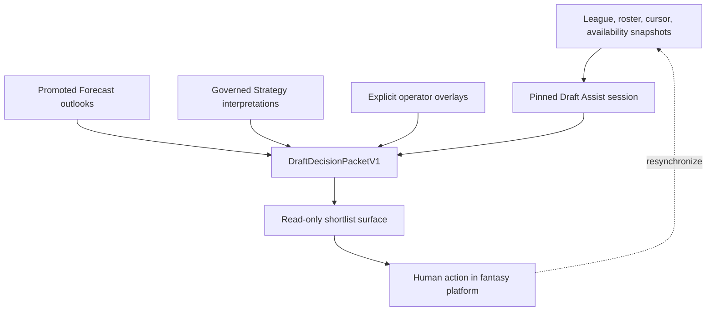

# Draft Assist Pilot 2 — field evidence and v0 contract map

Status: **non-production design candidate for operator review**

| Binding | Value |
| --- | --- |
| Authority | [TIBER-Ops #48](https://github.com/Prometheus-Frameworks/TIBER-Ops/issues/48) |
| Authority class | `bounded_branch_write` |
| Human decision owner | Joseph (`@Prometheus-Frameworks`) |
| Sole write repository | `Prometheus-Frameworks/TIBER-Ops` |
| Pinned Ops base | `ddfaddc01f356b9ba7dababce63963f394399e1b` |
| Product status | Design only; not implemented, activated, promoted, deployed, or adopted |
| Trace artifact | [`operator-draft-traces-v0.json`](../../pilots/bounded-goal/draft-assist-pilot-2/operator-draft-traces-v0.json) |
| Execution ledger | [`progress-ledger.md`](../../pilots/bounded-goal/draft-assist-pilot-2/progress-ledger.md) |

This package converts the field packet in #48 into a proposed trace shape,
capability map, missing-contract register, decision packet, synchronized-session
specialization, deterministic replay plan, and staged backlog. It does not
implement Draft Assist or alter any current TIBER program frontier.

The two non-architecture artifacts use
`pilots/bounded-goal/draft-assist-pilot-2/`, the nearest existing TIBER-Ops
convention for a bounded package with a ledger, instead of introducing the new
top-level `program/discoveries/` tree suggested as a preference in #48. This is
a path-only convention choice. It does not make this work an activated pilot.

## 1. Answer first

The smallest honest Draft Assist v0 is **shortlist-first, state-bound, read-only,
and fail-closed**:

1. Read an exact league, roster, draft cursor, and available-player snapshot.
2. Show turn distance and mechanically derived starter capacity.
3. Let the human choose a small candidate set.
4. Attach only current, governed Forecast outlooks and Strategy
   interpretations.
5. Record operator theses and selection intent in a separate overlay.
6. Let an agent synthesize the same pinned packet without receiving action
   authority.
7. Return a primary/fallback pair only when the packet's coverage gates support
   one; otherwise return a tie, operator tiebreak, insufficient-evidence, or
   unsupported-domain state.
8. Leave the final click in the fantasy platform and resynchronize after the
   human acts.

That v0 is useful without a universal TIBER ranking, hidden recommendation
function, automated drafting, medical inference, market model, IDP analogy, or
platform execution.

## 2. Authority and epistemic boundary

This is an explicitly authorized documentation/audit exception to the
one-active-implementation-lane rule. TIBER-Ops doctrine permits indexing,
auditing, and explicitly authorized docs work outside the active
implementation lane
([operating rule at the pinned base](https://github.com/Prometheus-Frameworks/TIBER-Ops/blob/ddfaddc01f356b9ba7dababce63963f394399e1b/docs/operating-map.md#L42-L53);
[PR review exception](https://github.com/Prometheus-Frameworks/TIBER-Ops/blob/ddfaddc01f356b9ba7dababce63963f394399e1b/runbooks/pr-review.md#L35-L40)).
The latest signed #22 state before the pin authorized only the bounded PR #46
correction and kept source-policy adoption, R1-0, and #45 R2-R9 inactive
([record](https://github.com/Prometheus-Frameworks/TIBER-Ops/issues/22#issuecomment-5080992929)).
The pinned merge explicitly activated no later frontier. This package does not
change #22 or #45, select a new frontier, implement a product capability, or
claim independent review.

### 2.1 Evidence classes

| Class | Meaning in this package | Permitted use |
| --- | --- | --- |
| Observed draft fact | League setting, pick, selected player, or direct room event supplied in #48 | Reproduce with source attribution |
| Operator thesis | Joseph's player view, risk preference, roster interpretation, or strategic hypothesis | Preserve as timestamped field evidence; never promote to model truth |
| Agent interpretation | A system concept developed in discussion | Propose as a design hypothesis; never rewrite as operator rationale |
| Governed repository evidence | A contract or artifact inspected at an exact repository head | Support a capability-state claim only |
| Missing evidence | State or evidence not present in the packet or governed repositories | Mark `unknown`, `not_recorded`, blocked, or unsupported |

No player rationale in this report is a ranking, projection, Strategy label, or
Forecast input. In particular, the six redraft mocks did not use schedule or
bye analysis during selection. Those concepts appear only as later design
diagnostics.

### 2.2 Human and agent authority

The user and agent may reason from the same pinned state. The agent may compare,
summarize, expose uncertainty, and preserve a fallback. The agent may not select
in the fantasy platform, submit a waiver claim, set a lineup, execute a trade,
activate a model, promote an artifact, or turn an operator thesis into system
evidence. `final_action_authority` is always `human`.

The practical role mapping follows #43 without instantiating its parked
coordinator/state-machine design:

| Role | This bounded package |
| --- | --- |
| Operator | Joseph owns intent, meaning, risk, correction, and all decision authority |
| Bounded writer | Codex writes only the three approved Ops artifacts on one branch |
| Deterministic verifier | Existing shell/JSON/Git checks establish mechanical facts only |
| Semantic reviewer | Executor self-review is recorded; fresh-context independent review remains pending |
| Logical coordinator | Not instantiated or simulated by this package |

## 3. `OperatorDraftTraceV0`

The proposed non-production trace contract and seven records are encoded in
[`operator-draft-traces-v0.json`](../../pilots/bounded-goal/draft-assist-pilot-2/operator-draft-traces-v0.json).
The artifact requires the following fields on every record:

```text
league_contract
observed_draft_state
selection
realistic_alternatives
operator_reasoning
selection_intent
agent_contribution
forecast_support_or_gap
strategy_support_or_gap
data_support_or_gap
product_surface_gap
not_used_during_decision
uncertainty
final_action_authority
```

### 3.1 Contract invariants

- Observed facts, operator theses, agent interpretations, Forecast outputs, and
  Strategy interpretations remain separately attributed.
- A complete board, availability snapshot, alternative, rationale, or league
  setting is never reconstructed.
- A room statement is contextual demand evidence, not a guaranteed trade offer
  or durable price.
- An exploration pick cannot be converted into a strict operator ranking.
- A current-information update without a governed source is recorded as an
  operator update, not admitted as Forecast or Data evidence.
- IDP remains visible and unsupported.
- The record describes a decision; it does not execute or endorse one.

### 3.2 Record and source-limit inventory

| Trace | Recorded selections | Explicit alternatives | Source-limited fields |
| --- | ---: | --- | --- |
| A — 18-team dynasty startup | 2 | Allen and Lamar at 2.07 | Playoff structure; board/cursor snapshots; Bowers alternatives; alternative availability; agent contribution; schedule/bye use |
| B — redraft mock 1 | 15 | `not_recorded` | Non-PPR scoring; QB/lineup/bench/playoffs; board/cursor; room events; alternatives; agent contribution |
| C — redraft mock 2 | 13 | Burden close range named in #48 | Non-PPR scoring; QB/lineup/bench/playoffs; board/cursor; snapshot-bound availability; other alternatives; room events; agent contribution |
| D — redraft mock 3 | 13 | `not_recorded` | Non-PPR scoring; QB/lineup/bench/playoffs; board/cursor; room events; alternatives; agent contribution |
| E — redraft mock 4 | 13 | `not_recorded` | Non-PPR scoring; QB/lineup/bench/playoffs; board/cursor; room events; alternatives; quantified stack relationship; agent contribution |
| F — redraft mock 5 | 13 | Davante Adams at 5.02 | Non-PPR scoring; QB and all starter slots except two flex; bench/playoffs; board/cursor; other alternatives; availability; agent contribution |
| G — redraft mock 6 | 13 | David Montgomery at 5.06 | Non-PPR scoring; QB/lineup/bench/playoffs; board/cursor; room events; other alternatives; availability; governed recovery/practice source; agent contribution |

For Traces B-G, `not_used_during_decision` explicitly contains bye-week and
schedule analysis. The JSON's `unknown` and `not_recorded` values are evidence
discipline, not incomplete implementation.

## 4. Redraft and dynasty requirements

Shared state should use common envelopes; decision meaning must not be
collapsed across formats.

| Concern | Shared contract | Redraft-specific interpretation | Dynasty-specific interpretation |
| --- | --- | --- | --- |
| League state | Scoring, teams, lineup slots, flex eligibility, bench, IR, taxi, playoffs, cursor | Current-season startable points and replacement | Current-season use plus multi-year asset rules |
| Candidate identity | Stable player/team/position identity and availability at a cursor | Current-season role and availability | Current-season role plus age/timeline and asset persistence |
| Outlook | Versioned scenarios, cutoff, uncertainty, coverage | Season, weekly, early/late, playoff-period outcomes | Multi-year outcome paths; no single-season projection as asset value |
| Replacement | League-specific eligible and available pool | Waiver and streaming baseline can change quickly | Waiver baseline plus roster scarcity and future-pick/player liquidity |
| Roster construction | Starter capacity, flex occupancy, bench lock, risk budget | Maximize deployable current-season paths | Balance deployability with development horizon and churn tolerance |
| Market context | Snapshot, format, provider, observed time, coverage | Draft-room price and waiver replacement | Startup price, trade liquidity, age curve, and future-pick exchange |
| Injury/schedule | Event provenance, effective time, scenario impact | Higher current-season and playoff weight | Current season still matters, but recovery and multi-year horizon differ |
| Decision mode | Draft, waiver, lineup, trade cursor | Seasonal draft versus in-season transactions | Startup versus rookie draft versus trade/in-season management |
| Portfolio | Optional operator overlay | Cross-league exposure is manager-specific | Cross-league exposure plus long-lived asset concentration |

The same player can therefore receive the same governed current-season outlook
while producing different **structural interpretations** in redraft and
dynasty. Neither format adapter may silently manufacture a universal value.

## 5. Current capability matrix

The following is an availability map, not an inventory-by-name. A file present
in a repository does not prove that it is promoted, consumed, current, or
available to a Draft Assist session.

<!-- CAPABILITY_MATRIX_START -->
Read-only inspection date: **2026-07-29 UTC**.

| Repository and exact inspected head | What exists at that head | Availability classification | Draft Assist boundary |
| --- | --- | --- | --- |
| [TIBER-Fantasy `85c5a706`](https://github.com/Prometheus-Frameworks/TIBER-Fantasy/commit/85c5a7061e552b84a0eb86d4fca6ff7aa7e4730d) | Sleeper types and sync paths represent scoring, roster positions, users, rosters, and traded picks ([client](https://github.com/Prometheus-Frameworks/TIBER-Fantasy/blob/85c5a7061e552b84a0eb86d4fca6ff7aa7e4730d/server/integrations/sleeperClient.ts#L3-L110), [sync route](https://github.com/Prometheus-Frameworks/TIBER-Fantasy/blob/85c5a7061e552b84a0eb86d4fca6ff7aa7e4730d/server/routes/leagueSyncRoutes.ts#L64-L155)). Existing sync/management is documented live, read-only, and human-owned ([current phase](https://github.com/Prometheus-Frameworks/TIBER-Fantasy/blob/85c5a7061e552b84a0eb86d4fca6ff7aa7e4730d/CURRENT_PHASE.md#L13-L27)). | Existing league sync is `implemented`, `consumed`, and documented live; dashboard state may be cached. An exact Draft Assist runtime/session is not proven. Draft session, live board, clock, current cursor, and live draft selection/pick feed are `absent`. ADP paths are mock/heuristic, not governed market evidence ([Sleeper ADP note](https://github.com/Prometheus-Frameworks/TIBER-Fantasy/blob/85c5a7061e552b84a0eb86d4fca6ff7aa7e4730d/server/adp/sleeper.ts#L21-L32)). | Best candidate owner for read-only snapshots, but current sync does not supply exact Draft Assist state or a submitted-lineup contract; provider/access expansion remains separately gated by #37. |
| [TIBER-Strategy `ffa7fba7`](https://github.com/Prometheus-Frameworks/TIBER-Strategy/commit/ffa7fba7b78c51931735a9d09a251aa00b499049) | Deterministic ontology production and Fantasy consumption exist ([README](https://github.com/Prometheus-Frameworks/TIBER-Strategy/blob/ffa7fba7b78c51931735a9d09a251aa00b499049/README.md#L19-L58)); the promoted ontology artifact is present but reports `row_count: 0` ([artifact](https://github.com/Prometheus-Frameworks/TIBER-Strategy/blob/ffa7fba7b78c51931735a9d09a251aa00b499049/exports/promoted/dynasty_strategy_ontology/dynasty_strategy_ontology_v1.json#L1-L6)). | Ontology path is `implemented`, `promoted`, and `consumed`; archetype assignment and template selection remain `gated`, with no advice/recommendation authority ([boundary](https://github.com/Prometheus-Frameworks/TIBER-Strategy/blob/ffa7fba7b78c51931735a9d09a251aa00b499049/docs/boundary.md#L23-L44)). Market, age, role security, and liquidity are `future_contract` or absent. | Can own structural meaning only after a separate contract. It cannot invent evidence, set a player order, select a template, or act. |
| [TIBER-Forecast `640c0419`](https://github.com/Prometheus-Frameworks/TIBER-Forecast/commit/640c0419170a96775362617cabcf8048c020c901) | Candidate-stage forward runtime machinery accepts externally injected exact pins and governance evidence ([runtime design](https://github.com/Prometheus-Frameworks/TIBER-Forecast/blob/640c0419170a96775362617cabcf8048c020c901/docs/forward-runtime-v1.md#L1-L113)). The current head also records approved generic full-PPR [target](https://github.com/Prometheus-Frameworks/TIBER-Forecast/blob/640c0419170a96775362617cabcf8048c020c901/docs/decisions/forward-scoring-target-disposition-2026-07-28.md) and [hash-equivalence](https://github.com/Prometheus-Frameworks/TIBER-Forecast/blob/640c0419170a96775362617cabcf8048c020c901/docs/decisions/scoring-profile-hash-equivalence-2026-07-28.md) dispositions. | Machinery is `implemented` but `gated` and not activated. No real 2026 forward run, promoted artifact, command, route, or downstream consumer exists; emitted candidate metadata is forced non-production and never consumer-eligible ([writer](https://github.com/Prometheus-Frameworks/TIBER-Forecast/blob/640c0419170a96775362617cabcf8048c020c901/src/artifacts/writeForwardCandidateArtifacts.ts#L51-L56)). The two dispositions authorize neither a run or model nor artifact promotion or downstream activation. Generic full-PPR scoring only; league-specific scoring fails closed. | No 2026 player outlook can enter a Draft Assist packet yet. Tier persistence, conditional states, season shape, and joint outcomes remain missing Forecast capabilities. |
| [TIBER-Data `3393a8f0`](https://github.com/Prometheus-Frameworks/TIBER-Data/commit/3393a8f0b7f4ffa640f63d712768beb1c52b917a) | Promoted historical player-season coverage for 2021-2025 and source-backed 2026 NFL Draft facts exist ([promoted index](https://github.com/Prometheus-Frameworks/TIBER-Data/blob/3393a8f0b7f4ffa640f63d712768beb1c52b917a/docs/contracts/promoted-artifacts-index.md#L35-L45), [coverage artifact](https://github.com/Prometheus-Frameworks/TIBER-Data/blob/3393a8f0b7f4ffa640f63d712768beb1c52b917a/exports/promoted/nfl/player_season_coverage_v0.json), [manifest](https://github.com/Prometheus-Frameworks/TIBER-Data/blob/3393a8f0b7f4ffa640f63d712768beb1c52b917a/exports/promoted/nfl/PLAYER_SEASON_COVERAGE_V0_PROMOTION_MANIFEST.json)). A governed 2024 team-week schedule/PBP candidate handles historical byes ([promotion review](https://github.com/Prometheus-Frameworks/TIBER-Data/blob/3393a8f0b7f4ffa640f63d712768beb1c52b917a/docs/reviews/team-week-raw-v0-2024-promotion-review-pr-d.md#L23-L67), [artifact](https://github.com/Prometheus-Frameworks/TIBER-Data/blob/3393a8f0b7f4ffa640f63d712768beb1c52b917a/exports/candidates/team_week_raw/team_week_raw_v0_2024_real_source_candidate.json), [validation](https://github.com/Prometheus-Frameworks/TIBER-Data/blob/3393a8f0b7f4ffa640f63d712768beb1c52b917a/exports/candidates/team_week_raw/team_week_raw_v0_2024_real_source_candidate.validation.json), [manifest](https://github.com/Prometheus-Frameworks/TIBER-Data/blob/3393a8f0b7f4ffa640f63d712768beb1c52b917a/data/manifests/team_week_raw_v0_2024_real_source_candidate.manifest.json)). | Historical artifacts are `promoted`; they are not current fantasy availability. Current 2026 schedule/byes are `absent`. True routes/personnel are `gated` or scaffolded ([route audit](https://github.com/Prometheus-Frameworks/TIBER-Data/blob/3393a8f0b7f4ffa640f63d712768beb1c52b917a/docs/data/nflverse-participation-route-proxy-audit.md#L50-L76)); governed injury/practice/current ownership truth is absent ([availability audit](https://github.com/Prometheus-Frameworks/TIBER-Data/blob/3393a8f0b7f4ffa640f63d712768beb1c52b917a/docs/audits/player-availability-season-coverage-forecast-readiness-2026-06-30.md#L75-L135)). | Historical presence cannot be used as live availability, market, medical, route, or schedule support. New source use remains separately gated. |
| [TIBER-Teamstate `61485d13`](https://github.com/Prometheus-Frameworks/TIBER-Teamstate/commit/61485d1309484bad300378ef5d9aaa67365d3d62) | Deterministic team-environment interpretation and artifact machinery exist ([README](https://github.com/Prometheus-Frameworks/TIBER-Teamstate/blob/61485d1309484bad300378ef5d9aaa67365d3d62/README.md#L3-L23)). The 2024 public contract/builder/validator/serve path is implemented. | Publication is `gated`: the [approval registry](https://github.com/Prometheus-Frameworks/TIBER-Teamstate/blob/61485d1309484bad300378ef5d9aaa67365d3d62/src/reports/publicReportPublicationApprovals.ts#L1-L13) and [public registry](https://github.com/Prometheus-Frameworks/TIBER-Teamstate/blob/61485d1309484bad300378ef5d9aaa67365d3d62/src/reports/publicReportRegistry.ts#L47-L57) are empty, and publication is disabled. The 2026 environment is mostly `public_data_pending` with one operator seed ([design note](https://github.com/Prometheus-Frameworks/TIBER-Teamstate/blob/61485d1309484bad300378ef5d9aaa67365d3d62/docs/teamstate-offensive-environment-v0.md#L5-L70)); committed movement/profile outputs are `fixture-only`. | Team-environment shape is partially supported, but no current/live 2026 team-state feed is available for Draft Assist. A stack interpretation cannot claim quantified shared environment from these fixtures. |
| [Role-and-opportunity-model `6435d8d3`](https://github.com/Prometheus-Frameworks/Role-and-opportunity-model/commit/6435d8d3c2c4e53dc45ab57a05a2716e2b47598d) | Deterministic WR/TE API and `RoleOpportunityProfileV0` contract exist ([README](https://github.com/Prometheus-Frameworks/Role-and-opportunity-model/blob/6435d8d3c2c4e53dc45ab57a05a2716e2b47598d/README.md#L43-L119), [contract](https://github.com/Prometheus-Frameworks/Role-and-opportunity-model/blob/6435d8d3c2c4e53dc45ab57a05a2716e2b47598d/docs/contracts/role-opportunity-profile-v0.md#L63-L123)). | Code is `implemented`; committed profiles are fictional/operator-seeded, route participation is proxy/null, and FORGE readiness is false. Real player routes, 11/12/13 personnel, two-WR route access, and source-backed pass blocking are `absent` or `fixture-only` ([readiness audit](https://github.com/Prometheus-Frameworks/Role-and-opportunity-model/blob/6435d8d3c2c4e53dc45ab57a05a2716e2b47598d/docs/audits/role-opportunity-readiness-audit-2026-05-26.md#L42-L138)). | Useful field vocabulary exists, but no admitted 2026 player truth supports personnel/route claims in a decision packet. |
| [TIBER-Rookies `a8254314`](https://github.com/Prometheus-Frameworks/TIBER-Rookies/commit/a825431402f89f7ec4fe69e72de073ca4b301ea3) | Rookie Alpha and the 2026 transition profile are governed/promoted; the current source head validates and consumes transition evidence in card/board mapping ([contract](https://github.com/Prometheus-Frameworks/TIBER-Rookies/blob/a825431402f89f7ec4fe69e72de073ca4b301ea3/docs/rookie-transition-profile-contract.md#L99-L138), [loader](https://github.com/Prometheus-Frameworks/TIBER-Rookies/blob/a825431402f89f7ec4fe69e72de073ca4b301ea3/lib/rookies/getRookieCardData.js#L25-L58), [promoted artifact](https://github.com/Prometheus-Frameworks/TIBER-Rookies/blob/a825431402f89f7ec4fe69e72de073ca4b301ea3/exports/promoted/rookie-transition-profile/2026_rookie_transition_profile_v0.json), [manifest](https://github.com/Prometheus-Frameworks/TIBER-Rookies/blob/a825431402f89f7ec4fe69e72de073ca4b301ea3/exports/promoted/rookie-transition-profile/2026_manifest.json)). | Evidence is `promoted`; current-head consumption is `implemented` and source-consumed. Exact-head deployment is not proven and the merge commit says production remains pinned to an earlier SHA. Runtime is static, with no live room, league state, or recompute ([README](https://github.com/Prometheus-Frameworks/TIBER-Rookies/blob/a825431402f89f7ec4fe69e72de073ca4b301ea3/README.md#L304-L317)). | Promoted rookie evidence can be referenced only through an accepted downstream contract; it does not supply fantasy draft availability or a 2026 Forecast outlook. |
| [TIBER-FORGE `af2ca4d5`](https://github.com/Prometheus-Frameworks/TIBER-FORGE/commit/af2ca4d5f67f04ed1fc58fef50051c8169545d11) | Early deterministic/static lanes and a promoted `FORGE_PLAYER_STATIC_V1` artifact exist ([README](https://github.com/Prometheus-Frameworks/TIBER-FORGE/blob/af2ca4d5f67f04ed1fc58fef50051c8169545d11/README.md#L3-L23), [artifact contract](https://github.com/Prometheus-Frameworks/TIBER-FORGE/blob/af2ca4d5f67f04ed1fc58fef50051c8169545d11/docs/forge-player-static-v1.md#L24-L42), [promoted artifact](https://github.com/Prometheus-Frameworks/TIBER-FORGE/blob/af2ca4d5f67f04ed1fc58fef50051c8169545d11/exports/promoted/forge_player_static/forge_player_static_v1.json)). | Service is `bootstrap/fixture/disk-backed`, not production/live. Promoted artifact rows have mixed semantics: player-specific evidence plus generated-baseline fixtures that fail closed ([gate](https://github.com/Prometheus-Frameworks/TIBER-FORGE/blob/af2ca4d5f67f04ed1fc58fef50051c8169545d11/docs/forge-player-static-v1.md#L113-L147)). No local reconception implementation or 2026 Draft Assist state was found. | Path-level promotion cannot be collapsed into universal player evidence. FORGE supplies no current market, routes, Teamstate, Forecast, or live decision state here. |
| [TIBER-Ops `ddfaddc0`](https://github.com/Prometheus-Frameworks/TIBER-Ops/commit/ddfaddc01f356b9ba7dababce63963f394399e1b) | Docs-only coordination, human authority, freshness discipline, fail-closed behavior, and no autonomous irreversible action are established ([README](https://github.com/Prometheus-Frameworks/TIBER-Ops/blob/ddfaddc01f356b9ba7dababce63963f394399e1b/README.md#L1-L18), [freshness contract](https://github.com/Prometheus-Frameworks/TIBER-Ops/blob/ddfaddc01f356b9ba7dababce63963f394399e1b/docs/architecture/cross-repo-freshness-and-current-state-registry-v0.md#L124-L166)). | Governance is `already_owned_and_supported`. The source-admissibility document is a merged candidate, **not adopted**, and its candidate source set is empty ([policy](https://github.com/Prometheus-Frameworks/TIBER-Ops/blob/ddfaddc01f356b9ba7dababce63963f394399e1b/docs/architecture/research-observatory-source-admissibility-policy-v0.md#L1-L27)). | Ops can coordinate ownership and authority only. It does not own player truth, product state, model output, or runtime behavior. |
| Future ManagerProfile / operator overlay | No repository or accepted contract was found. | `absent` and ownership-unassigned. | Operator theses, selection intent, privacy/retention, and cross-league exposure require a separate Ops ownership decision before implementation. |
<!-- CAPABILITY_MATRIX_END -->

State vocabulary:

- `implemented`: executable behavior exists at the pin.
- `consumed`: another relevant component reads the artifact or contract.
- `promoted`: a governed producer has admitted a version for consumption.
- `gated`: behavior or artifact exists but a gate prevents use.
- `parked`: deliberately inactive.
- `fixture-only`: test/example evidence exists without live or promoted
  availability.
- `absent`: no supporting contract or behavior was found in the bounded
  inspection.

### 5.1 Freshness evidence binding

The row-level dependency register is [Entry 3A of the execution
ledger](../../pilots/bounded-goal/draft-assist-pilot-2/progress-ledger.md#entry-3a--dependency-content-and-promotion-evidence).
It binds all nine repository heads and 40 load-bearing files to exact revisions,
content SHA-256 values, promotion/availability states, supersession checks, and
the `2026-07-29` verification date. It also binds the #48 authority body and the
latest signed pre-pin #22 authority record to content hashes.

This is a historical evidence snapshot, not a live registry. If any recorded
repository head or path changes, the snapshot must be re-resolved before
downstream use. Neither the snapshot nor a successful freshness check activates
a source, artifact, model, product surface, follow-up, or program frontier.

## 6. Classification of the 22 field findings

Each candidate receives one primary classification. A row may list dependent
gaps, but the primary classification is not duplicated.

| # | Candidate finding | Primary classification | Why |
| ---: | --- | --- | --- |
| 1 | League contract first | `partially_supported` | Existing product state can represent portions of league/scoring/roster context, but no complete state-bound Draft Assist contract is available. |
| 2 | ADP is not availability | `missing_evidence_contract` | No governed contract separates global anchor, format market, exact room availability, room demand, and operator value. |
| 3 | Turn-relative reach | `missing_strategy_concept` | Cursor distance and tier remainder need an inspectable structural interpretation, not a raw ADP penalty. |
| 4 | Tier persistence | `missing_forecast_capability` | Survival of an acceptable tier to a future cursor is an uncertain state forecast, not a static rank. |
| 5 | Roster risk budget | `missing_strategy_concept` | Floor and ceiling evidence can exist without a governed rule for how current roster stability changes a close choice. |
| 6 | Starter capacity / positional saturation | `missing_strategy_concept` | Lineup slots are observable, but deployability and bench-lock interpretation are not governed. |
| 7 | Elite-or-wait TE | `missing_strategy_concept` | It requires positional separation against a realistic league waiver/streaming baseline. |
| 8 | Acquisition window | `missing_strategy_concept` | A preferred tier does not imply that every current price is optimal. |
| 9 | Targeted wait-at-QB | `missing_strategy_concept` | A named acceptable set and its last-member boundary differ from generic position waiting. |
| 10 | Conditional state forecasts | `missing_forecast_capability` | Unsigned, landing-spot, recovery, and contingent-role states require versioned scenarios. |
| 11 | Season shape | `missing_forecast_capability` | Early workload, post-bye growth, and playoff-period value cannot be recovered honestly from one season total. |
| 12 | Bye-week topology | `missing_evidence_contract` | Exact schedule, lineup occupancy, bench optionality, and playoff rules must be bound before interpretation. |
| 13 | Progressive schedule weight | `missing_strategy_concept` | The proposed early/late weighting is a research hypothesis, not a current doctrine rule. |
| 14 | Personnel and route access | `missing_evidence_contract` | Relevant role concepts exist in adjacent work, but no admitted 2026 Draft Assist evidence bundle supplies the required personnel, alignment, route, and first-read state. |
| 15 | Stack correlation | `missing_strategy_concept` | Direct positive, cannibalization, shared environment, and shared failure must be decomposed; no automatic stack bonus is justified. |
| 16 | Waiver opportunity monitoring | `missing_product_surface` | It needs league-specific live state, governed change evidence, and a read-only monitoring surface. |
| 17 | Room-specific revealed demand | `missing_evidence_contract` | Direct statements and draft behavior need source, time, scope, and confidence without becoming market truth. |
| 18 | Operator thesis history | `future_operator_or_manager_profile` | Belief history belongs in an explicit overlay outside Forecast and universal Strategy. |
| 19 | Mock exploration mode | `future_operator_or_manager_profile` | Selection intent must distinguish exploration, thesis test, construction, and strict preference. |
| 20 | Cross-league exposure | `future_operator_or_manager_profile` | Portfolio concentration is manager-specific and must remain outside Forecast and universal Strategy. |
| 21 | IDP fail-closed | `unsupported_or_not_recommended` | No player-level IDP evidence/model/contracts were found; offensive analogy would be misleading. |
| 22 | Human final authority | `already_owned_and_supported` | Existing Ops authority separation already reserves product and irreversible decisions for Joseph. |

## 7. Missing-contract register

Every proposed owner below is a design routing candidate only. It grants no
authority and opens no follow-up.

| Question | Required evidence | Current owner | Proposed owner if none | Current status | Why the gap matters | Smallest honest first contract | Activation / promotion boundary |
| --- | --- | --- | --- | --- | --- | --- | --- |
| What exact league, roster, cursor, and turn distance are being discussed? | Versioned scoring, lineup, roster, draft picks, cursor, timestamps | TIBER-Fantasy for product state | n/a | Partial product state; no synchronized Draft Assist snapshot | Every downstream interpretation changes with format and cursor | `LeagueDraftSnapshotV0` with source, observed-at, immutable ID, and unknown fields | Separate Fantasy issue; read-only first; no write-back |
| Which players are actually selectable now or on waivers? | Snapshot-bound availability, roster ownership, waiver/transaction state | TIBER-Fantasy | n/a | Missing governed snapshot and unresolved platform-access boundary | A comparison of unavailable players is not executable | `AvailablePlayerSnapshotV0` with league/cursor binding and expiry | Requires separately approved provider access under #37; no acquisition here |
| What does ADP or market context measure? | Provider, format, population, retrieval time, licensing, coverage, percentile | None | TIBER-Data after operator adoption of an applicable source-use policy and satisfaction of source-specific gates | Absent / source and rights unresolved | Global ADP cannot stand in for room availability or operator value | `MarketCoordinateObservationV0`, explicitly non-prescriptive | Applicable policy adoption, source-specific admissibility/licensing, provenance, and promotion are all required before use |
| What room demand was directly revealed? | Actor, exact statement/behavior, time, league, cursor, confidence, privacy boundary | None | Future operator-overlay boundary; ownership decision in TIBER-Ops | Absent | A room event can affect acquisition timing but is not a market price or offer | `RoomDemandObservationV0` stored as local/operator context | Separate privacy/retention decision; never Forecast training evidence by default |
| Will an acceptable tier survive to the next pick? | Available set, future pick distance, format market, candidate tier definition, uncertainty | None | TIBER-Forecast | Missing capability | Static ranks cannot answer a state-transition question | `TierPersistenceScenarioV0` with assumptions and uncertainty | Only after market and availability inputs are governed and a Forecast artifact is promoted |
| How should turn-relative reach, a named acquisition window, and targeted wait-at-QB be interpreted? | Current cursor, return distance, available set, human-confirmed acceptable tier/targets, tier-persistence scenario, roster need | None | TIBER-Strategy | Missing Strategy concepts | Raw ADP delta cannot show when the last acceptable target may disappear or make generic QB waiting equivalent to a named target set | `AcquisitionWindowInterpretationV0` with `turn_relative_reach`, `named_targets`, `last_acceptable_member`, and blocked state | Requires current Fantasy snapshots and a governed tier-persistence input; no hidden player order or automatic reach penalty |
| Can the roster start another player at this position, and how much risk can it carry? | Lineup/flex eligibility, roster occupancy, candidate outcome distributions, operator risk setting | None | TIBER-Strategy | Missing concept | Counts alone misclassify a third RB in a two-flex league | `RosterCapacityInterpretationV0`; risk setting remains explicit operator input | Separate Strategy design and review; no template/recommendation activation |
| Is elite TE separation worth the price versus waiting? | Candidate outlooks, league-specific TE replacement and waiver streaming baseline | None | TIBER-Strategy | Missing concept and baseline | TE12 is not necessarily the replacement option the manager can obtain | `PositionalSeparationComparisonV0` with baseline provenance | Needs promoted Forecast outlooks and current waiver baseline |
| What landing, signing, or role state applies? | Contract/transaction event, team, effective time, alternative states, probabilities or unweighted scenarios | TIBER-Forecast for outlooks; evidence owner incomplete | TIBER-Data for governed events | Missing capability/contract | One static number hides materially different futures | `ConditionalPlayerStateV0` plus scenario-linked outlooks | Event evidence must be governed; Forecast promotion remains separate |
| What injury, practice, availability, and recovery state is known? | Source-bound event type, body/availability scope, observed/effective time, correction history, uncertainty | None | TIBER-Data | Missing evidence contract; source unresolved | Ungoverned updates can move a pick without being reproducible or medically interpretable | `PlayerAvailabilityEventV0`, descriptive and non-diagnostic | Qualified source/legal review, provenance, correction policy, and explicit promotion |
| How does value vary across the season, byes, and playoffs? | Schedule snapshot, lineup, bench optionality, playoff rules, weekly outlooks, uncertainty | TIBER-Data for schedules; Forecast/Strategy split for inference | n/a | Partial schedule presence; no Draft Assist consumption | Season totals hide timing and topology; retrospective use can rewrite rationale | `ScheduleTopologyV0` plus `SeasonShapeOutlookV0` | Schedule provenance first; Forecast then Strategy; never backfill Traces B-G |
| When, if ever, may schedule receive greater tiebreak weight in later replaceable tiers? | Governed schedule topology, candidate separation, replacement baseline, draft stage, empirical calibration, explicit operator policy | None | TIBER-Strategy | Missing concept; research hypothesis only | “Progressive schedule weight” could become an unsupported hidden preference if treated as doctrine | `ProgressiveScheduleTiebreakV0`, restricted to an inspectable tiebreak after stronger evidence | Requires governed schedule/season-shape inputs, empirical review, and separate operator approval; never retroactive to Traces B-G |
| What personnel, alignment, route, and opportunity access is supported? | 11/12/13 personnel, two-WR routes, alignment, pass-blocking, route participation, first-read/target earning | Role-and-Opportunity-Model for adjacent role contracts | TIBER-Data for governed inputs | Partial/adjacent; no admitted 2026 Draft Assist bundle | Narrative role claims otherwise outrun evidence | `RouteAccessEvidenceV0` with field presence, coverage, and absent-vs-zero semantics | Source admission and promoted role artifact required before Forecast/Strategy use |
| What correlation channel exists between two rostered players? | Joint scoring-event definitions, team environment, candidate outlooks, failure modes | None | TIBER-Strategy | Missing concept | “Stack” can hide positive, neutral, cannibalizing, and shared-downside channels | `RosterCorrelationInterpretationV0` with channel labels and no auto bonus | Separate Strategy contract; quantitative claims require governed evidence |
| What did the operator believe, when, and for what mode? | Timestamp, league, player/candidate, thesis text, confidence, source refs, selection intent, supersession | None | Ownership decision in TIBER-Ops for a future ManagerProfile/operator overlay | Absent | Without separation, personal beliefs can leak into universal artifacts | `OperatorOverlayEntryV0` with append/supersede semantics | Operator-controlled retention and privacy policy; excluded from Forecast evidence by default |
| How concentrated is the manager across leagues? | League-scoped rosters, exposure calculation, time, privacy, optional risk preference | None | Ownership decision in TIBER-Ops for a future ManagerProfile/operator overlay | Absent | Portfolio advice is personal and cross-league, not player truth | `ManagerPortfolioExposureV0` as an optional local overlay | Separate operator ownership/privacy decision; no universal Strategy label |
| What waiver event deserves attention? | League availability, route/workload change, teammate event, schedule, roster need, transaction cursor | None | TIBER-Fantasy for a future read-only surface | Missing product surface and upstream contracts | Generic news is not a league-specific opportunity | `WaiverOpportunityObservationV0` returning evidence and coverage, not auto claims | Requires governed availability/events and separate monitoring authority; no automatic claim |
| How should IDP be handled? | IDP positions, scoring, role/opportunity evidence, player outlooks, replacement baselines | None | Ownership decision in TIBER-Ops before any implementation repo | Unsupported | Dropping IDP hides a league constraint; borrowing offensive logic fabricates support | `UnsupportedDomainNoticeV0` carrying visible positions and blocked reads | Remains unsupported until separately authorized evidence, model, Strategy, and product work |

Human final authority does not receive a missing-contract row: it is already
governed by #22 and is fixed in both proposed contracts. No new ownership or
activation contract is required for that finding.

## 8. Candidate `DraftDecisionPacketV1`

`DraftDecisionPacketV1` is an inspectable comparison envelope, not production
code and not a ranking artifact.

```yaml
packet_id: immutable identifier
packet_version: v1
session_ref: synchronized session identifier
observed_context:
  league_snapshot_ref: required
  roster_snapshot_ref: required
  cursor_ref: required
  available_player_snapshot_ref: required for live comparison
  observations: facts with source and observed_at
candidate_set:
  selected_by: human | human_confirmed
  candidates: stable player identifiers
  completeness_claim: none
forecast_outlooks:
  artifact_ref: exact promoted artifact/run/cutoff
  per_candidate: outlook, scenarios, uncertainty, coverage
strategy_interpretations:
  ontology_version: exact version
  per_candidate: structural interpretations and blocked concepts
operator_overlays:
  refs: explicit operator theses, risk setting, selection intent
  universal_evidence: false
agent_synthesis:
  agent_identity: identity and role
  summary: evidence-bound comparison
  result_state: comparison_available | structural_tie |
                operator_tiebreak_required | insufficient_evidence |
                unsupported_domain
coverage_and_blocked_reads:
  covered: fields and candidates supported
  blocked: owner, reason, and required contract
primary_and_fallback_options_when_supported:
  primary: optional candidate ref
  fallback: optional candidate ref
  support_basis: required when populated
field_notes:
  operator observations and post-decision notes, separately attributed
final_action_authority: human
generated_at: timestamp
expires_at: timestamp
```

### 8.1 Packet invariants

1. All snapshot and artifact refs are immutable and resolve to the same session
   state.
2. `candidate_set` is human-selected or human-confirmed. The packet makes no
   completeness or “best available” claim.
3. Forecast values must carry exact promoted artifact, run, cutoff, scenario,
   coverage, and uncertainty refs. Missing coverage stays missing.
4. Strategy contributes interpretation, not hidden ranking or template
   activation.
5. Operator overlays cannot alter Forecast bytes or masquerade as universal
   Strategy evidence.
6. Agent synthesis may summarize and contrast only included evidence.
7. `primary` and `fallback` remain absent unless:
   - both are available at the packet cursor;
   - required league/roster/cursor refs are current;
   - the relevant Forecast and Strategy reads are governed;
   - no load-bearing blocked read remains; and
   - the support basis is inspectable.
8. A supported comparison may still return `structural_tie` or
   `operator_tiebreak_required`.
9. An unavailable or stale required snapshot returns
   `insufficient_evidence`.
10. An IDP candidate returns `unsupported_domain` while remaining visible.
11. The packet never submits an action.

### 8.2 Result and failure states

| State | Deterministic trigger | Primary/fallback fields | Required response |
| --- | --- | --- | --- |
| `comparison_available` | All required refs are current and compatible, the domain and every load-bearing read are supported, and an inspectable structural rule produces an ordered pair | Both populated with exact support basis | Render comparison and preserve human final action |
| `structural_tie` | All required refs and reads are supported, but the declared structural rules produce no separation | Both null | Show the tie and the evidence that failed to separate |
| `operator_tiebreak_required` | All required refs and reads are supported, but the remaining tradeoff depends on an explicit personal thesis, risk preference, exploration intent, or portfolio choice outside universal Strategy | Both null until the human supplies or confirms the overlay | Name the exact operator input needed; do not infer it |
| `insufficient_evidence` | A required ref/read is absent, expired, stale, mismatched, unpromoted, or below declared coverage | Both null | List blocked reads and require resync or a separately governed input |
| `unsupported_domain` | The candidate or requested interpretation is outside governed evidence/model/Strategy support | Both null | Keep the candidate visible, identify the unsupported domain, and make no analogy |

State evaluation is ordered fail-closed: incompatible state first yields
`insufficient_evidence`; an unsupported candidate/domain then yields
`unsupported_domain`; only a complete supported packet may evaluate tie,
operator tiebreak, or ordered comparison.

### 8.3 Ownership inside the packet

| Packet component | Candidate owner | Boundary |
| --- | --- | --- |
| Observed league/roster/cursor/availability context | TIBER-Fantasy | Read-only platform state; no execution |
| Governed evidence events | TIBER-Data or another separately approved producer | Provenance and promotion required |
| Forecast outlooks | TIBER-Forecast | Outcomes and uncertainty; no roster meaning |
| Strategy interpretations | TIBER-Strategy | Structural meaning; no fact invention or hidden action |
| Operator overlays | Future ManagerProfile/operator boundary, not yet assigned | Personal, optional, separately retained |
| Agent synthesis | User-selected agent operating on the packet | No authority and no unpinned reads |
| Product rendering | TIBER-Fantasy | Inspectable shortlist and blocked states |
| Final action | Human in fantasy platform | Never delegated by this contract |

## 9. Draft Assist specialization of the synchronized agent session

This proposal specializes the platform-neutral, state-bound interface in #39;
it does not create a competing general agent protocol.

#39's parent sketches remain the parent vocabulary:
`CapabilityManifest`, `LeagueStateSnapshot`, `DecisionPackage`,
`ExactActionApproval`, and `ActionReceipt`. The session below specializes
`LeagueStateSnapshot`; `DraftDecisionPacketV1` specializes
`DecisionPackage`. The smallest v0 uses only capability levels 0-2
(observe, explain, propose). It does not reproduce or activate level-3 exact
action approval, an action receipt, or level-4 standing authority.

```yaml
session_id: immutable identifier
interface_contract_ref: exact #39-compatible contract/version
specialization: draft_assist_v0
capability_manifest_ref: exact read-only capability declaration
platform_state_version_hash: required
platform_user_id: immutable platform-scoped identity
league_id: immutable platform league identity
roster_id: immutable platform roster identity
league_snapshot_id: required
roster_snapshot_id: required
draft_or_transaction_cursor: required
lineup_or_transaction_lock_context:
  state: open | locked | not_applicable
  effective_at: timestamp or explicit null
available_player_snapshot_id: required for live draft comparisons
waiver_state_snapshot_id: required for waiver comparisons, otherwise explicit null
league_contract:
  scoring_ref: required
  lineup_ref: required
  roster_rules_ref: required
forecast_refs:
  artifact_id: exact promoted artifact
  run_id: exact governed run
  cutoff: exact evidence cutoff
strategy_ontology_version: exact version
operator_overlay_refs: optional, explicit, separately owned
agent:
  identity: required
  role: compare | explain | record_field_note
  execution_authority: none
observed_at: timestamp
generated_at: timestamp
expires_at: timestamp
final_action_authority: human
```

### 9.1 Synchronization and failure rules

- Canonical user, league, and roster IDs remain distinct from their snapshot
  IDs; all state refs must bind those same entities and a compatible
  observation window.
- Cursor advancement, a human selection, a waiver transaction, roster change,
  scoring change, user/manager mismatch, lock-state transition, or expiry
  invalidates the affected packet.
- A changed available-player or waiver snapshot is not silently substituted.
- Forecast and Strategy refs remain exact even when a newer version exists; a
  new session is required to move versions.
- Missing required refs, unresolved ref identity, mixed league IDs, expired
  state, or cursor mismatch fail closed as `insufficient_evidence`.
- A candidate outside a supported domain fails closed as
  `unsupported_domain`.
- An agent may request resynchronization but may not perform the fantasy action
  that caused the cursor transition.
- The post-human-action sync creates a new state, preserving the prior packet
  as an audit trace rather than rewriting it.

### 9.2 Session ownership

| Session field group | Candidate owner | Authority boundary |
| --- | --- | --- |
| Platform state hash, manager identity, league/roster/cursor/availability/waiver/lock snapshots | TIBER-Fantasy read-only adapter over the authorized platform state | Normalize and expose only; no fantasy-platform action |
| Forecast artifact/run/cutoff refs | TIBER-Forecast | Produce/promote separately; session may only bind exact refs |
| Strategy ontology version | TIBER-Strategy | Produce/version separately; session may not activate templates |
| Operator overlay refs | Future ManagerProfile/operator owner, unresolved | Optional personal context; not Forecast evidence |
| Session assembly and expiry evaluation | TIBER-Fantasy as candidate product owner | Assemble compatible refs and fail closed; no authority expansion |
| Agent identity and role | User-selected agent | Consume the session; cannot mutate source state or gain authority from identity |
| Final action | Human manager | Performed outside this session; followed by read-only resynchronization |

## 10. Golden replay scenarios

These are deterministic future contract tests, not historical answer keys.
Where #48 requires a candidate that was not recorded as an actual live
alternative, the replay labels it as a synthetic candidate fixture rather than
rewriting the trace.

| Replay | Fixture and expected behavior | Blocked claims | Required repository contracts |
| --- | --- | --- | --- |
| 1. Bowers vs Jeanty/Nabers at dynasty 1.12 | Bind Trace A's league contract and label Jeanty/Nabers as synthetic candidates, not historical availability. **1A:** with no promoted multi-year outlook or medical/availability contract, expect `insufficient_evidence`. **1B:** with current governed outlooks for all three but a remaining personal dynasty tradeoff, expect `operator_tiebreak_required`; only the Bowers thesis is carried as an operator overlay. | “Best dynasty player”; reception-leader claim; Nabers medical/recovery conclusion; actual historical availability of Jeanty/Nabers | Fantasy league/cursor snapshot; Forecast dynasty scenarios; Strategy dynasty replacement/timeline; Data medical/availability if used |
| 2. Maye vs Allen/Lamar at 2.07 | Bind the named alternatives, 22-pick return distance, and observed 2.08 statement. **2A:** absent exact availability or promoted QB outlooks, expect `insufficient_evidence`. **2B:** with complete current support but the Maye thesis and room event as the remaining differentiators, expect `operator_tiebreak_required`. The demand event is displayed as context in both. | Guaranteed trade offer; durable market price; universal Maye-over-Allen/Lamar ranking | Fantasy availability/cursor; Forecast QB outlooks/tier persistence; Strategy acquisition window; room-demand observation contract |
| 3. Burden vs Zay/Egbuka, exploration | Bind complete current state/support, `selection_intent: exploration`, receiver foundation, and the later Egbuka field note. Expect `operator_tiebreak_required`, with primary/fallback null. The later update cannot become contemporaneous rationale or a strict order. | Strict Burden ranking; hindsight rationale; governed truth from public-statement notes | Operator overlay/intent; Fantasy roster context; Forecast scenarios; Strategy risk-budget interpretation; governed personnel evidence |
| 4. Judkins vs Montgomery under two risk budgets | Keep Forecast refs byte-identical. **4A:** stable RB floor present plus explicit ceiling-tolerant overlay produces `risk_capacity: spendable` and `operator_tiebreak_required`. **4B:** floor absent plus explicit stability-required overlay produces `risk_capacity: constrained` and `operator_tiebreak_required`. The deterministic assertion is the changed structural field, not a player answer. | Player projection changed by roster preference; universal “upside always wins” rule | Fantasy roster snapshot; Forecast scenario refs; Strategy risk-budget and starter-capacity contracts; governed availability evidence |
| 5. CMC/Purdy mixed correlation | Bind the four qualitative channels. **5A:** a qualitative roster-construction request expects `operator_tiebreak_required` with direct-positive, non-shared rushing-TD, shared-environment, and shared-failure fields. **5B:** a quantified covariance request without a governed joint artifact expects `insufficient_evidence`. No automatic stack bonus is emitted. | Guaranteed stack benefit; quantified covariance without evidence; schedule rationale retroactively used | Forecast joint-event evidence if quantified; Teamstate environment ref; Strategy correlation interpretation |
| 6. Elite-or-wait TE | Bind an elite candidate and a league waiver baseline. **6A:** missing or stale baseline expects `insufficient_evidence`. **6B:** a current fixture whose declared positional-separation values are equal expects `structural_tie`. TE12 is never substituted for the observed baseline. | Automatic elite-TE rule; universal round threshold; unobserved waiver options | Fantasy availability/waiver snapshot; Forecast TE outlooks; Strategy positional-separation contract |
| 7. Triple RB in two-flex vs one-flex | Bind two base RB slots in both fixtures and RB/WR/TE flex eligibility. **7A:** two flex slots yield RB-eligible capacity 4, all three RBs deployable, and one remaining slot. **7B:** one flex yields capacity 3, all three deployable, and zero remaining slots. Both expect `operator_tiebreak_required`: capacity changes, but neither fixture manufactures a pick preference or bench-lock claim. | “Three RB is always too many” or “always optimal”; bench lock from one flex alone; inferred lineup settings | Fantasy lineup/roster snapshots; Strategy starter-capacity interpretation |
| 8. Visible unsupported IDP candidate | Include an IDP candidate in Trace A's league with identity and slot visible. Expect exactly `unsupported_domain`, primary/fallback null, and explicit blocked reads. | IDP ranking, projection, replacement baseline, advice, or offensive analogy | Future IDP evidence, Forecast, Strategy, and product contracts; until then only unsupported-domain notice |

Replay assertions must verify the result state, bound refs, blocked claims, and
human authority. They must not assert which player the human should select.

## 11. Smallest honest Draft Assist v0

### 11.1 In scope for a future separately authorized v0

- Exact, read-only league/scoring/lineup/roster/cursor state.
- Exact available-player state where provider authority permits it.
- Turn distance and mechanical starter-capacity display.
- A human-selected shortlist.
- Structured side-by-side evidence with per-field provenance and coverage.
- Governed Forecast outlooks only where a current promoted artifact supports
  the player, format, horizon, and scenario.
- Governed Strategy interpretations only where the ontology and consumption
  contract support them.
- Separately stored operator theses, risk preference, and selection intent.
- Primary/fallback only behind the packet gates.
- Visible tie, operator-tiebreak, insufficient-evidence, and
  unsupported-domain states.
- Resynchronization after the human acts elsewhere.

### 11.2 Deliberately not in v0

- Universal rankings, hidden scores, or “best player available.”
- Automatic drafting, waiver claims, lineup changes, or trades.
- A market/ADP model or treating platform ADP as truth.
- Inferred room availability without a snapshot.
- Injury prediction, diagnosis, or unsourced recovery inference.
- Schedule optimization, playoff forecasting, or bye topology until governed.
- IDP reasoning.
- Cross-league portfolio optimization.
- ManagerProfile activation.
- Unpromoted 2026 Forecast use.
- Strategy template selection or recommendation activation.
- Expansion of Sleeper or another platform while its authority is unresolved.

## 12. Dependency graph



Missing or stale inputs block a read; they do not cause the packet to fill the
gap with a rank, generic ADP, or agent guess.

## 13. Staged backlog proposals

Every row is inactive and requires a separate operator-approved issue. The
authority class is a proposed bound, not authority granted by this document.

### NOW — designable from current governed state

| Proposal | Sole repository | Proposed authority class | Exit condition | Explicitly inactive boundary |
| --- | --- | --- | --- | --- |
| Reconcile the Draft Assist specialization with any future operator-accepted #39 interface, if and when separately authorized | TIBER-Ops | `bounded_branch_write` (docs only) | One non-duplicative specialization and stale-state matrix | #39 remains parked; no acceptance, implementation, or program-frontier change is implied |
| Define `LeagueDraftSnapshotV0` and `AvailablePlayerSnapshotV0` as read-only product contracts using only already-authorized platform fields | TIBER-Fantasy | `bounded_branch_write` | Contract fixtures expose unknown/unsupported fields and expiry | No provider expansion, UI, or write-back |
| Define structural semantics for starter capacity, acquisition window, and unsupported-domain output | TIBER-Strategy | `bounded_branch_write` | Ontology proposal passes independent review without recommendation activation | No operator-intent ownership, template selection, ranking, or product activation |
| Preserve the seven traces as future replay fixtures without player-answer assertions | TIBER-Ops | `bounded_branch_write` (docs/fixtures only) | Schema validation and source-parity review | No executable test harness in Ops |

### AFTER 2026 FORECAST — depends on promoted forward evidence

| Proposal | Sole repository | Proposed authority class | Dependency | Explicitly inactive boundary |
| --- | --- | --- | --- | --- |
| Publish a Draft Assist-safe player outlook comparison contract bound to exact 2026 run/cutoff/scenario refs | TIBER-Forecast | `bounded_branch_write` | Promoted 2026 Forward Forecast artifact and accepted consumption boundary | No run execution or feature admission by this proposal |
| Consume promoted Forecast refs in structural comparisons while preserving ties and blocked states | TIBER-Strategy | `bounded_branch_write` | Accepted Forecast comparison contract | No hidden player ordering |
| Render the synchronized shortlist packet and coverage states | TIBER-Fantasy | `bounded_branch_write` | Accepted snapshot, Forecast, Strategy, and session contracts | Read-only; no final-action execution |

### LATER RESEARCH — unresolved evidence, policy, or ownership

| Proposal | Sole repository | Proposed authority class | Research question | Stop boundary |
| --- | --- | --- | --- | --- |
| Market/ADP source and observation contract | TIBER-Data | `read_only_research` | What source, rights, format coverage, and timestamp semantics are admissible? | No acquisition or promotion before operator adoption of an applicable source-use policy and satisfaction of source-specific gates |
| Injury/practice/availability event contract | TIBER-Data | `read_only_research` | Can descriptive, corrected, source-bound current events be governed without medical inference? | Qualified source/legal review required |
| Schedule, bye topology, and season-shape evidence | TIBER-Data | `read_only_research` | What exact schedule and playoff state is available at a cutoff? | No retrospective rewrite of field traces |
| Weekly/period scenario outlooks | TIBER-Forecast | `read_only_research` | Can season shape be expressed with calibrated uncertainty? | No static-total decomposition by assumption |
| Personnel, route, alignment, and opportunity evidence | Role-and-Opportunity-Model | `read_only_research` | What governed inputs support route access and absent-vs-zero semantics? | No narrative role labels without evidence |
| ManagerProfile/operator-overlay ownership and privacy | TIBER-Ops | `operator_policy_decision` | Which repository, retention, privacy, and supersession rules own personal theses, selection intent, and exposure? | No profile implementation or cross-league aggregation |
| IDP ownership and evidence feasibility | TIBER-Ops | `read_only_research` | Is a separate governed IDP lane warranted and who would own it? | Remain visibly unsupported |
| Platform integration boundary | TIBER-Fantasy | `read_only_research` | Which state can be read under provider terms while preserving a human final click? | No execution, automation, or access expansion |

No follow-up issue is opened or implied approved by this backlog.

## 14. Verification envelope

Following #42, verification layers are not collapsed:

| Layer | State for this package | Evidence / limit |
| --- | --- | --- |
| Provenance | Completed by executor | #48 authority, exact Ops base/tree, nine exact read-only repository heads, 40 exact file paths/content hashes/promotion states/supersession checks, and the three-file boundary are recorded |
| Mechanical | Completed before push | JSON parse/parity, Markdown links, required sections, allowed classifications, terminal occurrence, diff hygiene, and changed-file boundary |
| Semantic | Executor self-review completed; independent review pending | Self-review can correct routine defects but cannot accept its own meaning |
| Operator | Pending | Joseph decides whether the contract map reflects intended product and governance meaning |
| Empirical | Not reached | Golden replays are designs only; no product, model, live state, or user outcome was tested |

Operator-legible completion envelope:

| Field | Value |
| --- | --- |
| Intent owner | Joseph |
| Intended outcome | Reviewable field-evidence report and v0 contract map |
| Exact scope | Three TIBER-Ops docs/non-production JSON files |
| Executor | Codex |
| Verifier relationship | Deterministic checks + executor self-review; independent and operator review remain separate |
| Freshness | Ops base and all capability heads, paths, content hashes, promotion states, and supersession evidence re-resolved on 2026-07-29 UTC |
| Authority state | Candidate only; no activation or approval |
| Next permitted action | Operator-selected independent review or operator correction; no merge is performed here |

## 15. Limitations and unresolved decisions

- The seven traces are supplied field evidence, not independently verified
  draft logs.
- Traces B-G omit most lineup, scoring, bench, playoff, board, and availability
  state. Their interpretations cannot be replayed as exact historical
  decisions without new source material.
- No governed 2026 player outlook is admitted by this document.
- No live availability, waiver, market, room-demand, injury, route, or IDP
  contract is made available here.
- The future ManagerProfile/operator-overlay repository and privacy model remain
  unassigned; TIBER-Ops owns only the future ownership decision.
- The candidate packet and session shapes are proposals. They do not supersede
  #39 or create runtime compatibility.
- “NOW” means designable under a later explicit authorization, not active.
- The dependency snapshot becomes historical when any recorded repository head
  or path changes and must be reverified before downstream use.
- Independent review remains a separate fresh-context gate owned by Joseph's
  workflow.

## 16. Non-goal confirmation

This package changes documentation, a non-production JSON example, and its
ledger only. It does not:

- implement Draft Assist;
- modify TIBER-Fantasy, TIBER-Strategy, TIBER-Forecast, TIBER-Data,
  TIBER-Teamstate, Role-and-Opportunity-Model, TIBER-Rookies, or TIBER-FORGE;
- activate a model, ontology template, product surface, integration, or
  ManagerProfile;
- run or alter the 2026 Forward Forecast program;
- use operator notes as model evidence;
- produce a player rank, projection, label, or answer key;
- expand platform access;
- open follow-up issues;
- change #22, #45, lane state, merge state, promotion state, or deployment
  state; or
- transfer final action authority away from the human manager.

## 17. Terminal decision

```text
draft_assist_pilot_2_contract_map_ready_for_operator_review
```
